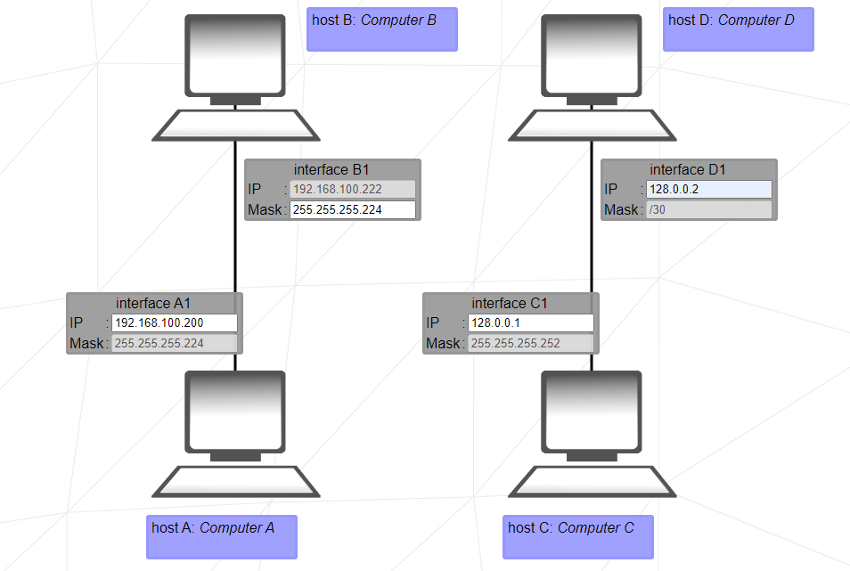

# NetPractice
This manual is a tool to learn by doing. It will give information just
before it is needed for the exercise. It contains information from
different sources. All the sources are referenced the first time they
were used.

In NetPractice project we are going to configure networks with IPv4
protokol. So what is IP?

IP is a connectionless protocol that operates at the network layer of
the OSI model. IP enables communication between hosts by carrying data
within packets. Each host is assigned an IP address which is used to
ensure that traffic is sent to the correct destination, synonymous in
many ways to a postal address that we place on a letter[^1].

Internet Protocol version 4 (IPv4) is the first version of the Internet
Protocol (IP) as a standalone specification[^2]. An IPv4 address (in the
case of v4) is built upon 32-bits, expressed in four numbers known as
octets. Each octet is 8 bits i.e one byte.

\

For a TCP/IP wide area network (WAN) to work efficiently as a collection
of networks, the routers that pass packets of data between networks
don't know the exact location of a host for which a packet of
information is destined. Routers only know what network the host is a
member of and use information stored in their route table to determine
how to get the packet to the destination host's network. After the
packet is delivered to the destination's network, the packet is
delivered to the appropriate host.

For this process to work, an IP address has two parts. The first part of
an IP address is used as a network address, the last part as a host
address.

What about (subnet) mask?

The second item, which is required for TCP/IP to work, is the subnet
mask. The subnet mask is used by the TCP/IP protocol to determine
whether a host is on the local subnet or on a remote network.

In TCP/IP, the parts of the IP address that are used as the network and
host addresses aren't fixed. Unless you have more information, the
network and host addresses above can't be determined. This information
is supplied in another 32-bit number called a subnet mask. The subnet
mask is 255.255.255.0 in this example. It isn't obvious what this number
means unless you know 255 in binary notation equals 11111111. So, the
subnet mask is 11111111.11111111.11111111.00000000[^3].

Within a subnet mask, the sequential bits that are on (1) are deemed the
network bits and the bits that off (0) are considered the host bits. For
example, 255.255.0.0 would result in the first 2 octets (16 bits) being
the network bits and the remainder being the host bits.

The last part here before Level 1 exercise can be hard to understand, if
you do not understand it, do not worry. You will understand when you are
done with that project ☺ I wanted to mention here as a reference.

In order to have the ability to send packages between two IP-addresses
they either need to be part of the same network or they need to be
connected by a router which is part of both subnets.

**IP Address Uniqueness**: Each device on a network must have a unique
IP address. If two devices are assigned the same IP address, they will
both try to communicate using that address, causing confusion and packet
loss.

**Subnet Masks**: The subnet mask determines which portion of the IP
address is used for the network and which portion is used for the host.
While different subnet masks can affect how devices interpret the
network, they do not change the fundamental need for each device to have
a unique IP address.

**Network Behavior**: When a device tries to communicate with the
duplicate IP address, it may receive responses from both devices,
leading to unpredictable behavior. This can cause dropped packets,
connection issues, and general network instability[^4].

# Level 1

There are 2 different networks here.

For IPv4, a network may be characterized by its subnet mask or netmask
yielding the routing prefix[^5].

\

The network on the left has the mask: 255.255.255.0.

In a Class C subnet mask, the network portion is the first three octets
with the hosts and subnets in just the remaining 8 bits of octet 4.
Class C is for smaller networks with fewer than 254 hosts[^6]. Because
the last digit is 0, we have the option from 0 to 255. In total 256 IP
addresses per subnet. Because the first one (104.94.23.0) is reserved
for the network and the last one (104.94.23.255) is reserved for the
broadcast (this is always the first and the last one), we have the
option from 1 to 254. 12 is reserved for B1, A1 can take between
104.94.23.1 and 104.94.23.11 or 104.94.23.13 and 104.94.23.254.

The network on the right has the mask: 255.255.0.0.

A Class B subnet mask claims the first two octets for the network,
leaving the remaining part of the address, the 16 bits of octets 3 and
4, for the subnet and host part. Class B is for networks with 256 to
65,534 hosts. So we have the option to changes two 8 bits in range.

\

# Level 2

In order to have the ability to send packages between two IP-addresses
they either need to be part of the same network or they need to be
connected by a router which is part of both subnets.

The following special address-ranges are reserved for Private Networks:

10.0.0.0 – 10.255.255.255

172.16.0.0 – 172.31.255.255

192.168.0.0 – 192.168.255.255

The following address-range is reserved for so-called loopback
addresses:

127.0.0.0 – 127.255.255.255

Mask is there to decide which range of ip-adresses are part of the same
subnet.  
There are 2 different ways of writing the mask:

- "Dot-decimal notation": 255.255.255.0

- "Class Inter-Domain Routing" or "CIDR": /24

<table>
<colgroup>
<col style="width: 8%" />
<col style="width: 20%" />
<col style="width: 26%" />
<col style="width: 22%" />
<col style="width: 21%" />
</colgroup>
<thead>
<tr>
<th style="text-align: center;"><strong>CIDR</strong></th>
<th style="text-align: center;"><strong>Dot-decimal</strong></th>
<th style="text-align: center;"><strong>Number of IP-addresses 
per subnet</strong></th>
<th style="text-align: center;"><strong>Usable IP-addresses 
per subnet</strong></th>
<th style="text-align: center;"><strong>Number of subnets</strong></th>
</tr>
</thead>
<tbody>
<tr>
<td style="text-align: center;">/32</td>
<td style="text-align: center;">255.255.255.255</td>
<td style="text-align: center;">1</td>
<td style="text-align: center;">0</td>
<td style="text-align: center;">256</td>
</tr>
<tr>
<td style="text-align: center;">/31</td>
<td style="text-align: center;">255.255.255.254</td>
<td style="text-align: center;">2</td>
<td style="text-align: center;">0</td>
<td style="text-align: center;">128</td>
</tr>
<tr>
<td style="text-align: center;">/30</td>
<td style="text-align: center;">255.255.255.252</td>
<td style="text-align: center;">4</td>
<td style="text-align: center;">2</td>
<td style="text-align: center;">64</td>
</tr>
<tr>
<td style="text-align: center;">/29</td>
<td style="text-align: center;">255.255.255.248</td>
<td style="text-align: center;">8</td>
<td style="text-align: center;">6</td>
<td style="text-align: center;">32</td>
</tr>
<tr>
<td style="text-align: center;">/28</td>
<td style="text-align: center;">255.255.255.240</td>
<td style="text-align: center;">16</td>
<td style="text-align: center;">14</td>
<td style="text-align: center;">16</td>
</tr>
<tr>
<td style="text-align: center;">/27</td>
<td style="text-align: center;">255.255.255.224</td>
<td style="text-align: center;">32</td>
<td style="text-align: center;">30</td>
<td style="text-align: center;">8</td>
</tr>
<tr>
<td style="text-align: center;">/26</td>
<td style="text-align: center;">255.255.255.192</td>
<td style="text-align: center;">64</td>
<td style="text-align: center;">62</td>
<td style="text-align: center;">4</td>
</tr>
<tr>
<td style="text-align: center;">/25</td>
<td style="text-align: center;">255.255.255.128</td>
<td style="text-align: center;">128</td>
<td style="text-align: center;">126</td>
<td style="text-align: center;">2</td>
</tr>
<tr>
<td style="text-align: center;">/24</td>
<td style="text-align: center;">255.255.255.0</td>
<td style="text-align: center;">256</td>
<td style="text-align: center;">254</td>
<td style="text-align: center;">1</td>
</tr>
</tbody>
</table>

The number of usable IP-addresses per subnet is lower than the total
number of IP's because

the first address is reserved as the network-address of the subnet and

the last address is reserved as a broadcast-address.

Again we have two different network. The first mask is given as
255.255.255.224. So let's calculate our options:

> 255 – (224 – 1) = 32

So we have 256 / 32 = 8 subnets.

We can change only the last byte because the first 3 bytes are full
(255.255.255.x). So let’s create 8 subnets with that IP (192.168.100.x).

> 192.168.100.0 - 192.168.100.31
>
> 192.168.100.32 - 192.168.100.63
>
> 192.168.100.64 - 192.168.100.95
>
> 192.168.100.96 - 192.168.100.127
>
> 192.168.100.128 - 192.168.100.159
>
> 192.168.100.160 - 192.168.100.191
>
> 192.168.100.192 - 192.168.100.223
>
> 192.168.100.224 - 192.168.100.255

The IP of the computer is 192.168.100.222. Our computer is in that
subnet: 192.168.100.192 - 192.168.100.223. So the other device in that
subnet can have the IP 192.168.100.193 - 192.168.100.221 (192 is
reserved for the network, 222 is for computer B, 223 is for the
broadcast).

For the second network, we can choose any IP excluding generally
reserved IPs. Some of the common reserved IPS are:

10.0.0.0 – 10.255.255.255 🡺 10.x.x.x

172.16.0.0 – 172.31.255.255 🡺 172.16.x.x – 172.31.x.x

192.168.0.0 – 192.168.255.255 🡺 192.168.x.x

127.0.0.0 – 127.255.255.255 🡺 127.x.x.x

\

# Level 3

Here we have a switch in our network, which learns the Ethernet
addresses of connected devices and then only forwards data to the port
connected to the device to which it is addressed.

When we have a switch, we still have the same mask. The subnet does not
change when we use a switch.

The IP of the devices can be between 104.198.58.1 and 104.198.58.126.

\

# Level 4

Here we have again one network having a router inside. Router connects
computers and other devices to the Internet. A Router Interface is
defined as a connection point on a router that requires a unique IP
address belonging to a specific network or subnet, allowing the router
to interconnect different networks by forwarding packets.

The IPs given by the exercise have the same three octets in the
beginning. We have to calculate the IPs. The last 64 IPs (192-255) are
used by Interface R3 and the first 128 IPs (0-127) are used by Interface
R2. Interface R1 can have the IPs between 128 and 192. We can choose a
mask for maximum 192 – 128 = 64 IP range. So we can make the mask
255.255.255.192.

\

# Level 5

We have different interfaces of the router. Different networks between
routers may have different masks.

Now we are introduced to a routing table.

The routing table is there to store all the different paths to all the
networks, the device is part of.  
In NetPractice the routing table consists of two elements,
the **destination** and the **next hop:**  
The **destination** consists of the network-address that you want to
send a package to, combined with the CIDR of that
network: 190.3.2.252/30. If you don't want to specify a destination, you
can just set it to default or 0.0.0.0/0.  
The **next hop** is the address of the next router that you need to send
the packages to in order to reach the destination-network.

\

It has the network destination (which can be set to default or 0.0.0.0)
and the gateway (next hop). Because the machines route to the router,
the gateway will be the interface IP of the router.

\

# Level 6:

- Now the router will connect us to the internet.

- Let's fill the routing table of the internet. Here we have to fill
  both the destination subnet and the netmask (which is together:
  network identifier).

- To calculate the CIDR we need the network mask (255.255.255.128).

255 – (128 - 1) = 128

128 = 2 ^ 7

32 – 7 = 25

- The destination of the internet is the network address of the computer
  (114.101.184.128). So the network identifier is 114.101.184.128/25.

- The next hop, or gateway, is the address of the next station to which
  the packet is to be sent on the way to its final destination. The
  gateway of the internet is the router's interface IP (163.172.250.12).

- The 163.172.250.1 IP in the routing table of the router is defined by
  the test but not seen in the network. The logic behind is: Actually
  the internet also works like a router too. And the interface IP of the
  internet to send the information to the router is 163.172.250.1.

\

# Level 7

- We have to define masks for the interfaces.

/24: 255.255.255.0 =\> this mask enables one subnet with IPs from 0 to
255

/25: 255.255.255.128 =\> this mask enables two subnets with IPs from 0
to 127 and 128 to 255

/26: 255.255.255.192 =\> this mask enables four subnets with IPs from 0
to 63, 46 to 127, 128 to 191, and 192 to 255.

/27 - /30 =\> these are also can be used.

/31: 255.255.255.254 =\> this mask cannot be used because it does not
have enough IP addresses for the devices

/32: 255.255.255.255 =\> this mask also cannot be used because it does
not have enough IP addresses for the devices

\

# Level 8

- Let’s clean all spaces.

- The gateway of the internet will be the interface of the router (R12).

- We know that the internet has a destination address. The router (R1)
  will have the same destination address. The gateway will later be the
  interface of the other router (R21).

- We know the destination address of the internet. Let’s work on it.

- 139.249.193.0/26 which means this internet package goes to IP
  addresses between 139.249.193.0 - 139.249.193.63. We can create
  different subnets with 255.255.255.240 mask and use them in different
  local networks:

  - 139.249.193.0 - 139.249.193.15

  - 139.249.193.16 - 139.249.193.31

  - 139.249.193.32 - 139.249.193.47

  - 139.249.193.48 -139.249.193.63

\

# Level 9

- First let's correct the wrong masks according to what is given to us.

- We know the gateway of host D, so we can correct that network.

- Host C has reserved IP address so let’s change them to 9.0.0.x.

- Let's correct the IPs of the router R2 accoring to the routing tables
  of host C and host D.

- Let’s correct the IPs of the host A and B (please remember the
  reserved IPs).

- Then we are going to change the routing table of the internet.
  According to the goals above, host A and host C need to communicate
  with the host Internet. So the table should have the network address
  of those hosts with CIDRs.

- Lastly the routing table of the router R1.

- While doing those do not forget to change the IPs for the ones
  reserved for private networks and hosts have default destination.

\

# Level 10

- Here there are so much stuff predefined. So let’s clean the other
  things and fill accordingly.

- We want internet to connect every device, so the destination should
  cover all the IPs. Let’s make the destination of the internet
  131.45.86.0/24.

- First network with interface R11 has the mask 255.255.255.128 and the
  IP 131.45.86.1.

So the IPs 131.45.86.0-131.45.86.127 are taken by that network. Let’s
fill in the missing parts in that network.

- Second network between routers has the mask 255.255.255.252 and the IP
  131.45.86.254. So the IPs 131.45.86.252-131.45.86.255 are taken by
  that network.

- Third network with interface R23 has the mask 255.255.255.192 and the
  IP 131.45.86.131. So the IPs 131.45.86.128- 131.45.86.191 are taken by
  that network.

- Fourth network can have CIDR /30 and the IP range 131.45.86.192-
  131.45.86.195.

- R1 has the destination not defined for host H3. We are going to define
  according to what we set before: 131.45.86.192/30.

\

[^1]: https://www.packetcoders.io/a-beginners-guide-to-subnetting/

[^2]: https://en.wikipedia.org/wiki/IPv4

[^3]: https://learn.microsoft.com/en-us/troubleshoot/windows-client/networking/tcpip-addressing-and-subnetting

[^4]: https://www.quora.com/Can-I-assign-two-of-the-same-IP-addresses-on-the-same-network-with-a-different-subnet-mask

[^5]: https://en.wikipedia.org/wiki/Subnet

[^6]: https://avinetworks.com/glossary/subnet-mask/
